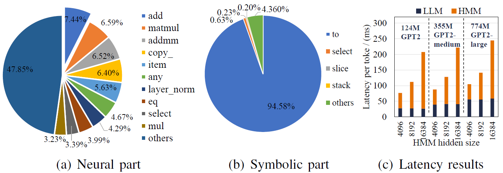
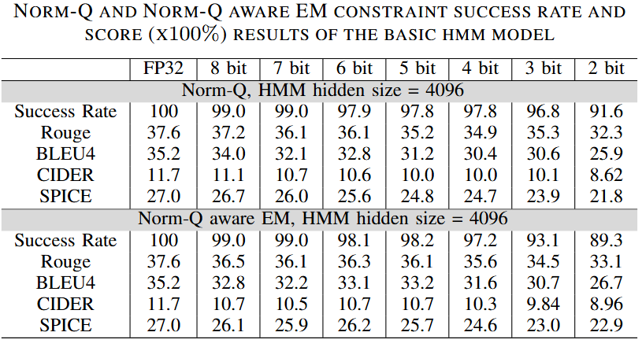

# Norm-Q

Codebase for Norm-Q: Effective Compression Method for Hidden Markov Models in Neuro-Symbolic Applications. [Asilomar 2025][[paper]()]

<p align="center">

</p>

The Norm-Q method is a normalized linear quantization approach for compressing probabilistic symbolic models, especially Hidden Markov Models (HMM).

In the case of the constrained generation task of large language models, we successfully quantize an HMM of 4096 hidden states to 8 bits without loss and, at most, 3 bits with acceptable loss.

<p align="center">

</p>

## Installation

This project is built on Ctrl-G. We recommend using `conda` or `mamba` for setting up the environment for Ctrl-G. The environment has been tested on cuda/12.1 and pytorch 2.5.1.

```bash
conda create --name <env_name> python=3.11 mamba
# replace conda with mamba to accelerate
conda activate test
conda install pytorch torchvision torchaudio pytorch-cuda=12.1 -c pytorch -c nvidia
conda install conda-forge::faiss-gpu #only required for HMM distillation
conda install transformers==4.41.2 huggingface_hub==0.23.4 sentencepiece protobuf notebook ipywidgets
conda install -c conda-forge lemminflect rouge-score evaluate spacy cupy
python -m spacy download en_core_web_sm
pip install -e . # installing ctrlg locally
bash scripts/download_eval_dependencies.sh
```

## Quick start

Check [tutorial_ctrlg.ipynb](./tutorial_ctrlg.ipynb) and [Ctrl-G repository](https://github.com/joshuacnf/Ctrl-G) to learn about the neuro-symbolic application.

The [ctrlg](./ctrlg/) directory contains the source code of HMMs.

The [distillation](./distillation/) directory contains the code for building an HMM.

The [eval_metrics](./eval_metrics/) directory contains the code for evaluation.

### running process

- Prepare an LLM model and a dataset
- Distill an HMM model from the LLM
- Quantize the model, conduct EM aware training if needed
- Run benchmarking and evaluate


### examples

Check the [scripts](./scripts/) directory to run applications, conduct quantization and evaluate.

[scripts/test.py](./scripts/test.py) is a runnable example of the application.

[scripts/test_benchmark.py](./scripts/test_benchmark.py) is a benchmarking program of quantization and inference.


[scripts/test_acc.py](./scripts/test_acc.py) includes scripts for evaluation.


### assets

The raw models refer to Ctrl-G, which are available on huggingface: https://huggingface.co/ctrlg.

The dataset is common_gen: https://huggingface.co/datasets/allenai/common_gen.

## Post-training-quantization

Norm-Q quanitize the HMM model using linear quantization followed by a row-wise normaliztion. The values are still float number, meaning that we quantize the weights to low-bit floating points and index them by integers. See the paper for the logics and `scripts/test_benchmark.py` for the implementation.


## Model distillation and EM-aware training

Check [distillation/tutorial_distillation.ipynb](./distillation/tutorial_distillation.ipynb) or the [README of Ctrl-G](https://github.com/joshuacnf/Ctrl-G) for distillation and HMM training.

[distillation/train_hmm.py](./distillation/train_hmm.py) includes codes for EM aware quantization.

## Citation

Norm-Q: Effective Compression Method for Hidden Markov Models in Neuro-Symbolic Applications.

## Reference

```bibtex
@article{zhang2024adaptable,
  title={Adaptable logical control for large language models},
  author={Zhang, Honghua and Kung, Po-Nien and Yoshida, Masahiro and Van den Broeck, Guy and Peng, Nanyun},
  journal={Advances in Neural Information Processing Systems},
  volume={37},
  pages={115563--115587},
  year={2024}
}
```

## LISCENSE

[LISCENCE FILE](./LICENSE)
